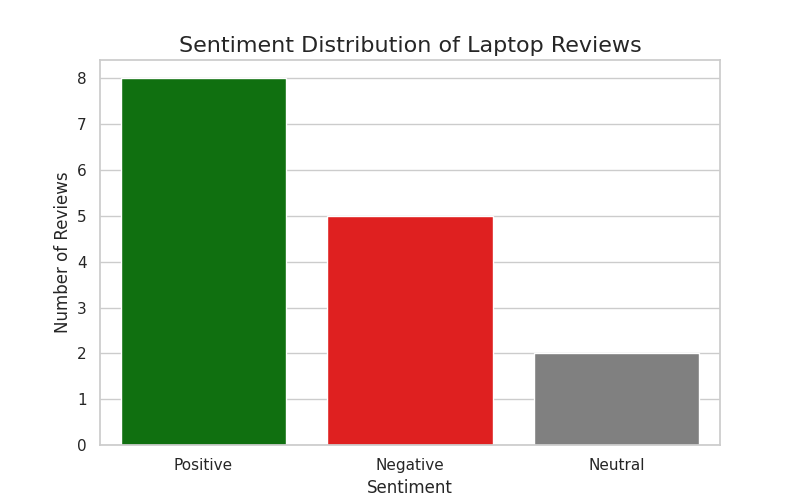

# 💬 CodeAlpha_SentimentAnalysis

NLP Sentiment Analysis on product reviews for the CodeAlpha Data Analytics Internship. This project classifies text as Positive, Negative, or Neutral using Python and the VADER lexicon, highlighting both the power and limitations of rule-based NLP.


🌟 **Intern:** Prinkle Kella | **CodeAlpha Data Analytics Internship** | **June 2026**

---

## 🎯 Project Objective

The objective of this task was to analyze text data and classify it as positive, negative, or neutral using Natural Language Processing (NLP) techniques. This project focuses on understanding public opinion from product reviews and critically evaluating the effectiveness of lexicon-based sentiment tools.

---

## 🛠️ Tools & Technologies

* Python 3.12
* vaderSentiment: For rule-based sentiment analysis (specifically attuned to social media and reviews)
* Pandas: For data manipulation and creating DataFrames
* Seaborn & Matplotlib: For visualizing sentiment distributions
* Tabulate: For clean terminal output formatting

---

## 📊 Dataset Source

* Dataset: Programmatically generated Amazon-style laptop reviews
* Description: 15 realistic product reviews containing a mix of clear positive, clear negative, and nuanced neutral statements.
* Note: Data was generated in-code to ensure reproducibility and avoid 404 link errors.

---

## ⚙️ Methodology & Implementation

### Data Generation

Created a realistic dataset of 15 diverse laptop reviews and saved to CSV.

### VADER Initialization

Loaded the SentimentIntensityAnalyzer to parse text.

### Polarity Scoring

Looped through reviews to extract the compound score (ranging from -1.0 to +1.0).

### Classification Rules

Applied industry-standard thresholds:

* Compound >= 0.05 ➡️ Positive
* Compound <= -0.05 ➡️ Negative
* Between -0.05 and 0.05 ➡️ Neutral

### Visualization

Created a countplot to show the distribution of sentiments across the reviews.

---

## 📸 Output Previews

### Sentiment Distribution



### Analyzed Data Table (Sample)

| Review                             | Compound Score | Sentiment |
| ---------------------------------- | -------------- | --------- |
| I absolutely love this laptop!...  | 0.8685         | Positive  |
| Worst purchase ever. It crashed... | -0.6249        | Negative  |
| The battery life is decent, but... | 0.0000         | Neutral   |

---

## 💡 Key Learnings & Challenges

### Understanding Compound Scores

Learned how VADER calculates a normalized, weighted composite score for text, which is much more reliable than simply counting positive/negative words.

### The Limitations of Rule-Based NLP 🚨

A critical discovery: VADER misclassified some nuanced reviews (e.g., "Do not buy this. It overheats constantly" was scored as Positive).

Why?

VADER is a lexicon-and-rule-based model. It does not understand context, sarcasm, or negation (like "Not worth the money"). It simply matches words to a dictionary.

This proves that while VADER is great for quick social media sentiment, production-grade analysis requires context-aware machine learning models (like BERT or RoBERTa).

---

## 🚀 How to Run Locally

### Clone the Repository

```bash
git clone https://github.com/PrinkleMahshwari/CodeAlpha_SentimentAnalysis.git
```

### Navigate to the Project Directory

```bash
cd CodeAlpha_SentimentAnalysis
```

### Install the Required Libraries

```bash
pip install -r requirements.txt
```

### Run the Analysis Script

```bash
python src/sentiment.py
```

---

## 📂 Project Structure

```text
CodeAlpha_SentimentAnalysis/
├── data/
│   ├── reviews.csv
│   └── analyzed_reviews.csv
├── screenshots/
│   └── sentiment_distribution.png
├── src/
│   └── sentiment.py
├── README.md
└── requirements.txt
```

---

## 🙏 Acknowledgements

This project was completed as part of the **CodeAlpha Data Analytics Internship Program**.

* **Internship Organization:** [CodeAlpha](https://www.codealpha.tech/)
* **Repository:** [CodeAlpha_SentimentAnalysis](https://github.com/PrinkleMahshwari/CodeAlpha_SentimentAnalysis)

Special thanks to **CodeAlpha** for providing this internship opportunity.

---

## 🔗 Important Links

| Resource                | Link                                                                                           |
| ----------------------- | ---------------------------------------------------------------------------------------------- |
| Internship Organization | [CodeAlpha](https://www.codealpha.tech/)                                                       |
| GitHub Repository       | [CodeAlpha_SentimentAnalysis](https://github.com/PrinkleMahshwari/CodeAlpha_SentimentAnalysis) |
| GitHub Profile          | [PrinkleMahshwari](https://github.com/PrinkleMahshwari)                                        |

---

## 📈 Skills Gained

* Natural Language Processing (NLP)
* Sentiment Analysis
* VADER Lexicon
* Text Classification
* Data Storytelling
* Critical Evaluation of AI Tools
* Python for Data Analytics

---

## 🚀 Future Improvements

Possible future improvements for this project include:

* Implementing transformer-based models (Hugging Face/ROBERTA) for context-aware sentiment
* Scraping real-time Amazon or Twitter data for larger datasets
* Adding aspect-based sentiment analysis (e.g., rating the "battery" vs the "screen" separately)
* Creating an interactive Streamlit app where users can input their own text

---

## 🎥 LinkedIn Project Demonstration

As part of the CodeAlpha Internship requirements, a project explanation video will be published on LinkedIn.

**Status:** ⏳ Pending

**LinkedIn Post Link:** To be added after publication.

---

## ⭐ Internship Progress

| Task                      | Status      |
| ------------------------- | ----------- |
| Web Scraping              | ✅ Completed |
| Exploratory Data Analysis | ✅ Completed |
| Data Visualization        | ✅ Completed |
| Sentiment Analysis        | ✅ Completed |

---

## 📜 License

This project was developed for educational purposes and as part of the CodeAlpha Data Analytics Internship Program.

---

## 👨‍💻 Author

**Prinkle Kella**

BS Software Engineering Student | Data Analytics Intern

* GitHub: [PrinkleMahshwari](https://github.com/PrinkleMahshwari)
* LinkedIn: Link to be added
* Project: **CodeAlpha_SentimentAnalysis**
* Internship: **CodeAlpha Data Analytics Internship**

Thank you for visiting this repository. Feedback, suggestions, and improvements are always welcome.

---

## 🔍 SEO Keywords

Sentiment Analysis Project, Natural Language Processing, NLP Project, Python Sentiment Analysis, VADER Sentiment Analysis, Text Classification, Opinion Mining, Product Review Analysis, Customer Feedback Analysis, Rule-Based NLP, Sentiment Detection, Text Analytics, Python NLP Project, Data Analytics Project, Machine Learning Preparation, VADER Lexicon, Social Media Sentiment Analysis, Amazon Review Analysis, Data Storytelling, Python Data Analytics, Pandas Project, Seaborn Visualization, Sentiment Classification, Positive Negative Neutral Classification, Artificial Intelligence Project, CodeAlpha Internship, Data Science Portfolio, Python Portfolio Project, Text Mining, Review Sentiment Analysis, NLP Internship Project, Language Processing, AI and NLP, Customer Opinion Analysis, Python Programming.
